# Hospital Patient ETL Analytics

An end-to-end ETL and data analytics project using Python, Microsoft SQL Server, T-SQL, and Power BI.

## Project Overview

I primarily built this project to showcase my ability to complete a full ETL (Extract, Transform, Load) and data analytics workflow. I started with a raw CSV dataset containing hospital patient encounters and worked through the process of preprocessing the data, loading it into SQL Server, designing a data warehouse, creating an analytics layer, and finally visualizing the results in Power BI.

I used Python and Pandas to inspect and validate the source data before loading it into SQL Server. The data was first loaded into a staging table that kept the same denormalized structure as the source dataset. From there, I used T-SQL to transform the staged data into a star-schema data warehouse made up of dimension and fact tables.

After building the warehouse, I created an analytics schema with SQL views designed around the business questions I wanted to answer. Power BI then connects to SQL Server and uses this prepared data to create visualizations for cost, length of stay, readmission, outcomes, satisfaction, and patient demographics.

## Technologies

- Python
- Pandas
- mssql-python
- Jupyter Notebook
- Microsoft SQL Server
- T-SQL
- Power BI
- Kaggle

## High Level Project Process

The project follows the following data pipeline:

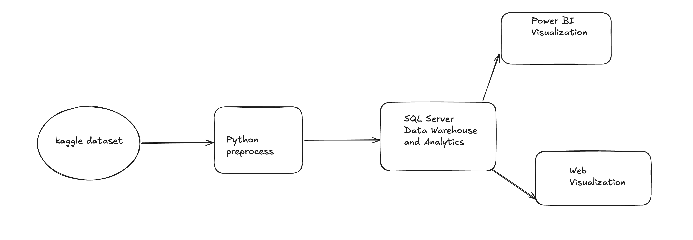

I divided the SQL Server database into three schemas because I wanted each part of the ETL process to have a clear purpose.

1. staging - Temporary landing area for the cleaned and validated source data.
2. warehouse - Stores the permanent dimensional model used for analytics.
3. analytic - Contains views that prepare the warehouse data for reporting and visualization.

The staging schema holds the data before it is transformed, the warehouse contains the structured data, and the analytics schema contains the views used to answer business questions.

# ETL Process

I divided the project into five main steps: collecting the source data, preprocessing and staging it with Python, building the SQL Server data warehouse, creating the analytics layer, and visualizing the results with Power BI.

## Step 1: Data Collection

The source hospital patient dataset was obtained from Kaggle as a CSV file. The dataset contains information about individual patient encounters, including patient ID, age, gender, medical condition, procedure, treatment cost, length of stay, readmission status, patient outcome, and satisfaction score.

The original CSV is denormalized, so information about the patient, condition, procedure, outcome, and encounter is stored together in the same row. I kept this structure during the first part of the ETL process because I wanted the staging data to stay close to the original source before transforming it into the warehouse.

## Step 2: Python Preprocessing and Staging

For the preprocessing part of the project, I used Python with Pandas inside a Jupyter Notebook. I first loaded the CSV file into a DataFrame so I could understand the dataset before inserting anything into the database.

I checked the number of rows and columns, column data types, missing values, duplicate records, and descriptive statistics. I also reviewed the values in the dataset to make sure they made sense for the type of information each column represented.

I did not want to load the data into SQL Server without validating it first, so I created a Python validation function to identify valid and invalid data. This gave me a place to apply basic data-quality rules before the records reached the database.

After preprocessing the data, I connected Python to Microsoft SQL Server using the mssql-python library. I created the staging schema and a denormalized staging.Patient table, then inserted the processed data into that table.

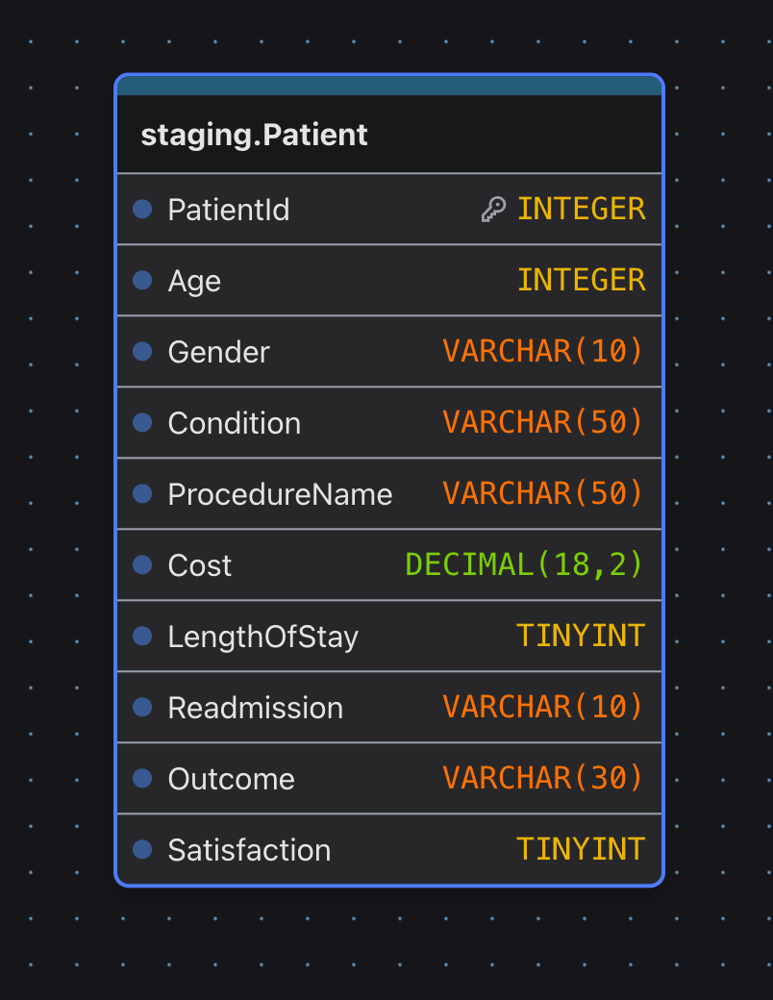

I intentionally kept the staging table denormalized and close to the structure of the original CSV. At this point, the goal was not to create the final database design. The staging table acts as the middle point between the source data and the data warehouse, which gives me a place to verify the loaded data before transforming it.

After loading the data, I ran validation queries to make sure the expected records were inserted successfully and that the data in SQL Server matched the processed data from Python.

## Step 3: Building the Data Warehouse

After the data was successfully loaded into staging, the next step was to transform the denormalized data into a structure that was better suited for analytics. I created a separate warehouse schema in SQL Server for this part of the project.

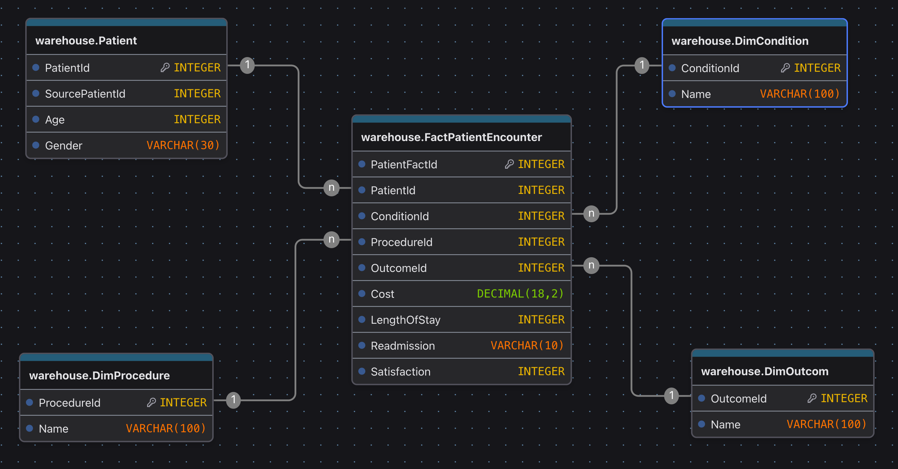

I decided to use a **star schema** with four dimension tables and one fact table. Since this is a relatively small dataset, I did not think a more complicated warehouse design was necessary. The star schema also works well for the questions I want to answer because most of the analysis revolves around patient encounters and comparing those encounters by patient, condition, procedure, and outcome.

The warehouse contains four dimensions:

- DimPatient
- DimCondition
- DimProcedure
- DimOutcome

The center of the model is FactPatientEncounter. Each row in this table represents a patient encounter. Instead of repeating values such as a condition name or procedure name in every encounter, the fact table stores IDs that reference the corresponding dimension records.

The fact table also stores the values I want to measure and analyze, including Cost, LengthOfStay, and Readmission. For example, because cost is stored at the encounter level, I can calculate total or average cost and then compare those calculations by condition, procedure, patient demographics, or another dimension.

For the patient dimension, I kept both a warehouse PatientId and the original SourcePatientId. The warehouse ID is used for relationships inside the warehouse, while SourcePatientId preserves the identifier from the original dataset.

### Loading the Warehouse

I used T-SQL stored procedures to move and transform the data from staging.Patient into the warehouse instead of manually inserting records into each table.

The dimension tables need to be loaded before the fact table because the fact table depends on their IDs. The load process first finds the unique patients, conditions, procedures, and outcomes in staging and inserts them into their corresponding dimension tables.

The general load order is:

1. DimPatient
2. DimCondition
3. DimProcedure
4. DimOutcome
5. FactPatientEncounter

Once the dimensions are loaded, the fact-table procedure can match the values from staging to the correct dimension IDs and create the patient encounter records.

I also used T-SQL procedures and validation queries to test the loading process and make sure records were being transferred correctly from staging into the warehouse.

## Step 4: Data Analysis

Once I had the warehouse working, I created a third schema called analytic. I wanted to keep the actual warehouse tables separate from the SQL used to answer the business questions.

The warehouse is responsible for storing the data in a structured form, while the analytics layer is responsible for presenting that data in a form that is easier to analyze. Instead of making Power BI repeatedly join the fact table with all of the dimensions, I created SQL views that already expose the fields needed for analysis.

For example, if I want to analyze treatment cost by medical condition, an analytics view can join FactPatientEncounter to DimCondition and provide the condition name along with cost and the other fields needed for the analysis. Power BI can then use that view without needing to know how all of the warehouse tables are connected.

For this project, I created the 3 analytics views around the questions I wanted to answer.

### Business Questions

1. How do treatment cost and hospital resource use vary across medical conditions? 
2. How do treatment cost and hospital resource use vary across medical procedures?
3. Which medical conditions and procedures have the highest readmission rates?

## Step 5: Power BI Visualization

The final part of the project is Power BI. I connected Power BI directly to the SQL Server database and used the data from the analytics layer to build the visualizations.

I intentionally kept most of the data preparation and transformation logic in Python and SQL Server rather than doing everything inside Power BI. I wanted Power BI to mainly be the reporting and visualization layer. This is also because I don't have much experience using Power BI. 

However, I needed to make one DAX function to readmission.

```DAX
Readmission Rate =
DIVIDE(
    CALCULATE(
        COUNTROWS('analytic vw_PatientAnalytics'),
        'analytic vw_PatientAnalytics'[Readmission] = "Yes"
    ),
    COUNTROWS('analytic vw_PatientAnalytics')
)
```

The measure calculates the number of encounters where readmission is Yes and divides it by the total number of encounters.

## Business Questions and Findings

### 1. How do treatment cost and hospital resource use vary across medical conditions?
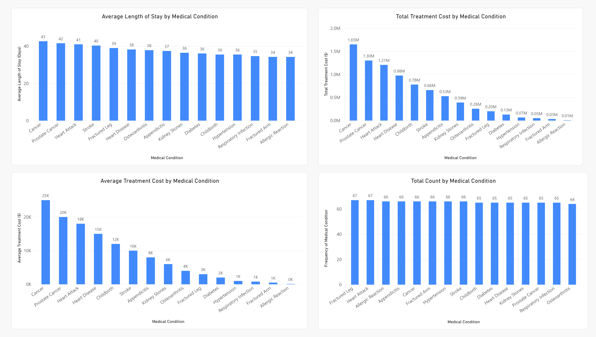
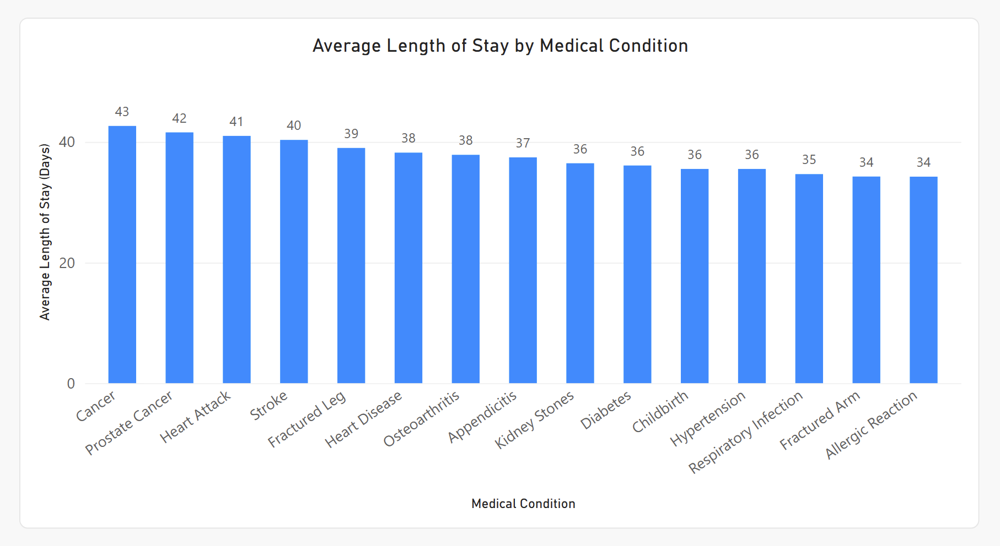
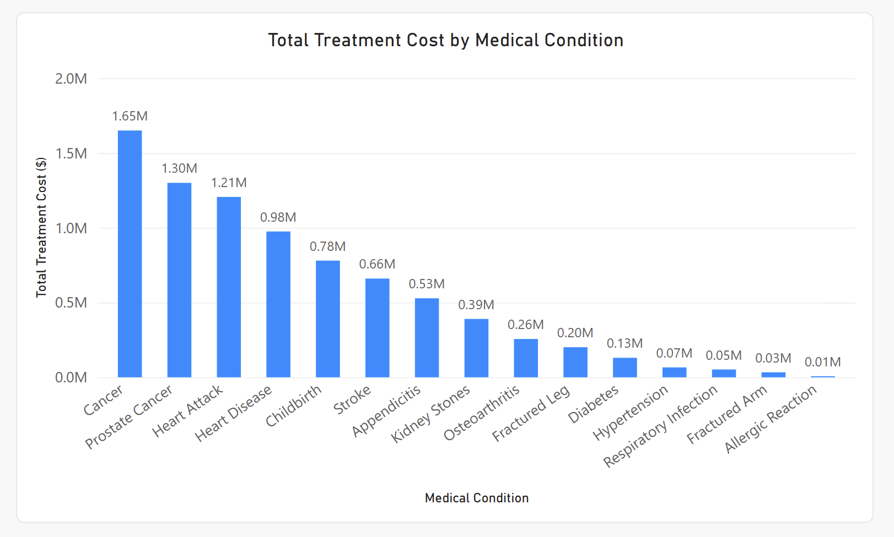
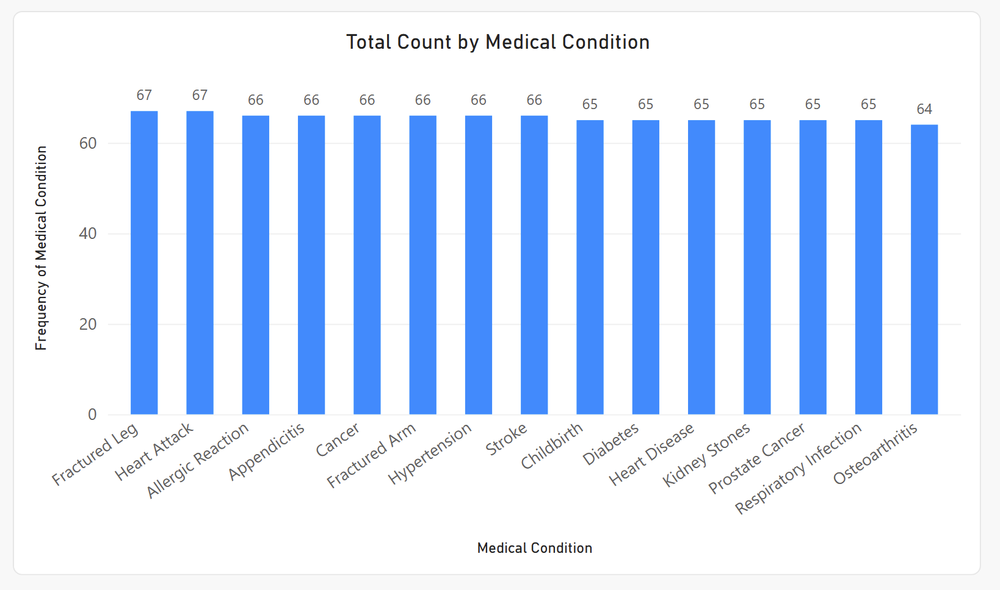
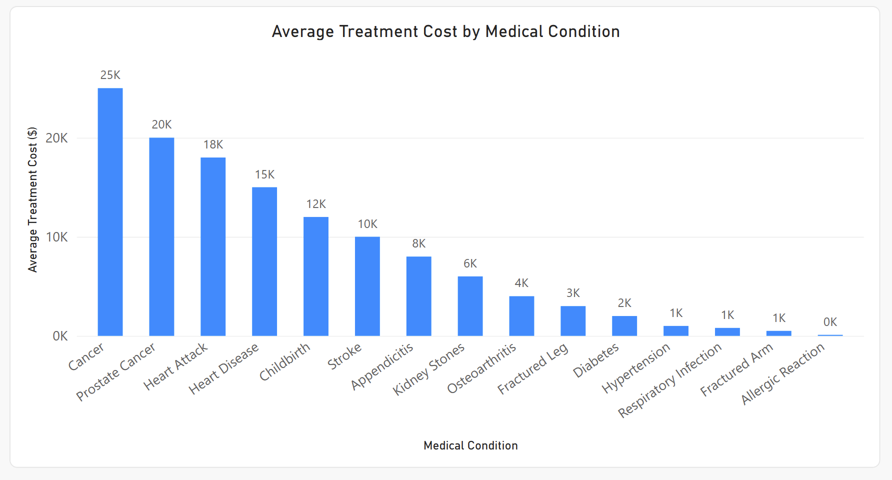

Treatment cost varies significantly across the medical conditions in the dataset. Cancer had the highest total treatment cost at approximately 1.65 million dollars and also had the highest average treatment cost at approximately 25,000 dollars per encounter. Prostate Cancer followed with a total cost of approximately 1.30 million dollars and an average cost of 20,000 dollars. Heart Attack had the third highest total cost at approximately 1.21 million dollars and an average cost of 18,000 dollars.

The number of encounters was very similar across the different conditions. Most conditions had between 64 and 67 encounters. This shows that the differences in total treatment cost were not mainly caused by some conditions having a much higher number of encounters. Instead, the average treatment cost had a larger effect on the total cost.

There was less variation in length of stay compared to treatment cost. Cancer had the highest average length of stay at 43 days, followed by Prostate Cancer at 42 days, Heart Attack at 41 days, and Stroke at 40 days. The remaining conditions had an average length of stay between 34 and 39 days.

Overall, Cancer had the highest treatment cost and the longest average hospital stay in the dataset. The number of encounters stayed almost the same across conditions, while treatment cost showed much larger differences.

### 2. How do treatment cost and hospital resource use vary across medical procedures?
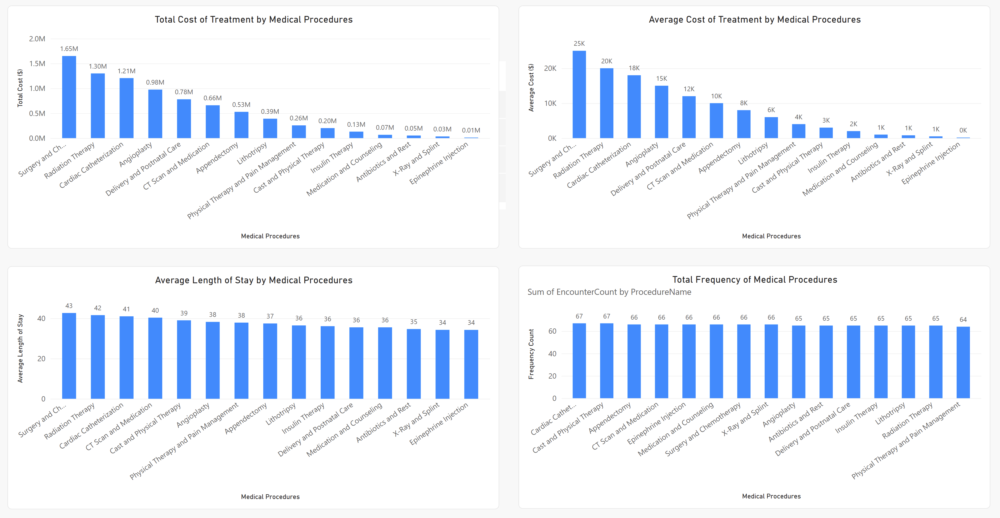
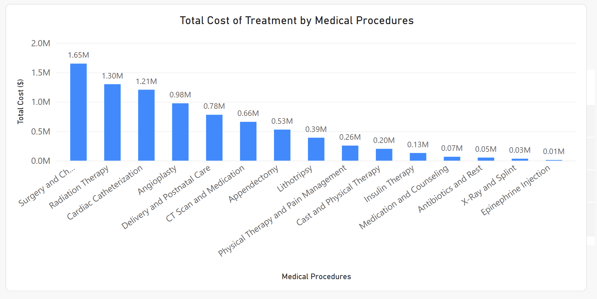
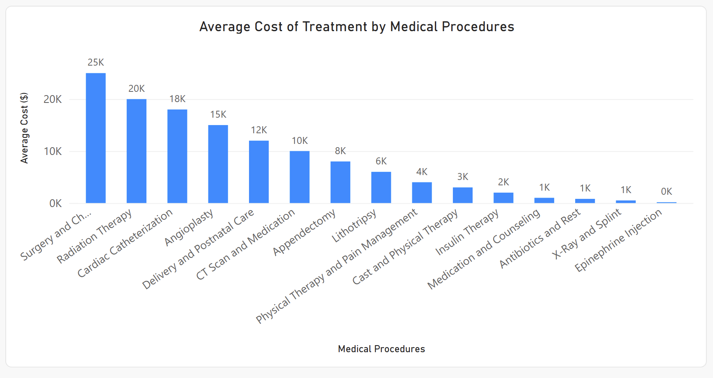
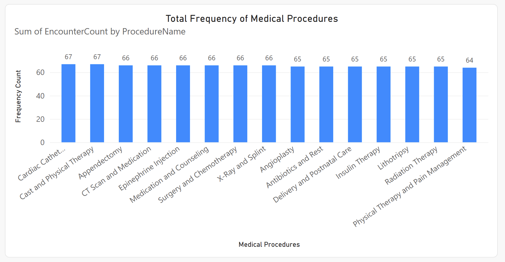
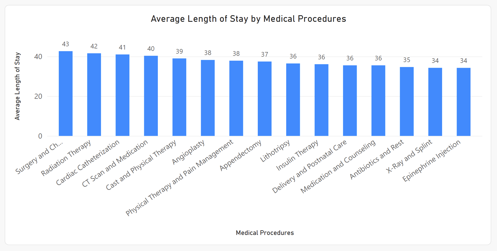

Treatment cost also varies significantly across medical procedures. Surgery and Chemotherapy had the highest total treatment cost at approximately 1.65 million dollars and an average treatment cost of approximately 25,000 dollars. Radiation Therapy followed with approximately 1.30 million dollars in total cost and an average cost of 20,000 dollars. Cardiac Catheterization had approximately 1.21 million dollars in total cost and an average cost of 18,000 dollars.

The frequency of the procedures was very similar, with each procedure appearing approximately 64 to 67 times. Because the number of procedures was almost the same, the differences in total cost were mainly related to the average cost of each procedure rather than how frequently the procedure occurred.

Surgery and Chemotherapy also had the longest average length of stay at 43 days. Radiation Therapy had an average stay of 42 days, followed by Cardiac Catheterization at 41 days. The remaining procedures had average stays between 34 and 40 days.

Overall, the procedure analysis shows that treatment cost varies much more than procedure frequency. Surgery and Chemotherapy had both the highest treatment cost and the longest average hospital stay in the dataset.

### 3. Which medical conditions and procedures have the highest readmission rates?
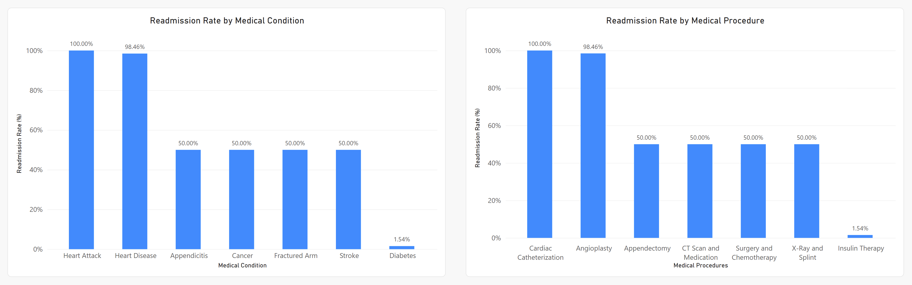
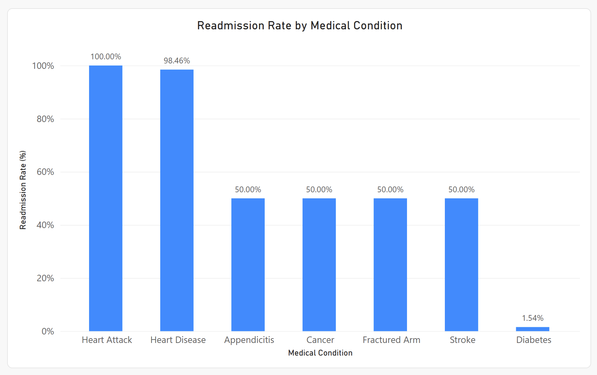
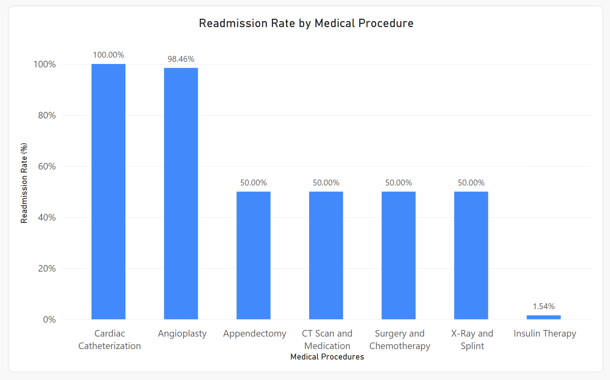

Heart Attack had the highest readmission rate among medical conditions at 100%. Heart Disease was very close at 98.46%. Appendicitis, Cancer, Fractured Arm, and Stroke each had a readmission rate of 50%, while Diabetes had the lowest readmission rate at 1.54%.

For medical procedures, Cardiac Catheterization had the highest readmission rate at 100%, followed by Angioplasty at 98.46%. Appendectomy, CT Scan and Medication, Surgery and Chemotherapy, and X-Ray and Splint each had a readmission rate of 50%. Insulin Therapy had the lowest readmission rate at 1.54%.

The results show a large difference in readmission rates depending on the medical condition and procedure. Heart Attack and Cardiac Catheterization had the highest readmission rates in the dataset, while Diabetes and Insulin Therapy had the lowest.

## Project FAQ and Design Decisions

### 1. Why did I build this project?

I built this project to practice and demonstrate the complete ETL and data analytics process. I wanted to understand how data can move from a raw source through preprocessing, staging, a data warehouse, an analytics layer, and finally into a visualization tool. The project also gave me a chance to combine several technologies I have been learning. Python is used for preprocessing and validating the source data, SQL Server and T-SQL are used for storing and transforming the data, and Power BI is used for the final analysis and visualization.

### 2. Why did I use separate staging, warehouse, and analytics schemas?

I wanted to separate the database based on what each part of the data pipeline is responsible for. The staging schema is where the processed CSV data is first loaded into SQL Server. I keep this data close to its original denormalized structure so I can verify it before transforming it. The warehouse schema contains the permanent dimensional model. This is where the staging data is transformed into dimension and fact tables. The analytics schema is then used for views that join and prepare the warehouse data for analysis. I chose this structure because I did not want the source data, warehouse tables, and reporting queries mixed together. Each schema has a specific purpose and makes the overall ETL process easier to understand and maintain.

### 3. Why did I choose a star schema?

I chose a star schema because the main purpose of the warehouse is analytics. Most of my questions start with a patient encounter and then analyze that encounter by medical condition, procedure, outcome, or patient information. Because of this, FactPatientEncounter works as the center of the model. It contains measurements such as cost, length of stay, readmission, and satisfaction. The dimension tables contain descriptive information about the patient, condition, procedure, and outcome. A star schema also keeps the model relatively simple. 

### 4. What are the limitations of the dataset?

The dataset is useful for practicing ETL, SQL, data warehousing, and visualization, but it is not a good dataset for making conclusions about real hospital patients or healthcare systems. One limitation I noticed during the analysis is that many categories have almost the same number of encounters. For example, most medical conditions and procedures appear around 64 to 67 times. Some of the results also follow very regular patterns, including extremely high readmission rates for certain categories. Because of these patterns, I treat the dataset as sample data for demonstrating the technical process rather than as reliable healthcare data. 

### 5. Why did I use SQL views instead of doing all of the analysis in Power BI?

I wanted SQL Server to handle most of the data preparation and Power BI to mainly handle visualization and interactive analysis. Main reason is I'm more familiar with SQL than Power Bi. I know how to work with SQL and it just made sense to go with SQL.

